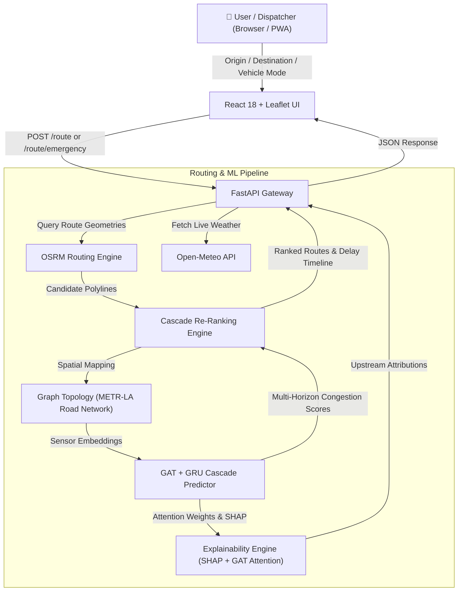

# 🛣️ Cascade-Aware Traffic Navigation System (CascadeNav)

[](https://fastapi.tiangolo.com)
[](https://react.dev)
[](https://pytorch.org)
[](https://vitejs.dev)
[](https://leafletjs.com)
[](https://web.dev/progressive-web-apps/)

> **CascadeNav** is an open-source, graph-temporal traffic forecasting and route re-ranking navigation system. It models multi-hop congestion propagation across spatial road topologies using **Graph Attention Networks (GAT)** coupled with **Gated Recurrent Units (GRU)**, dynamically re-ranking open-source routing engine paths to bypass predicted bottlenecks before they materialize.

---

## 🌟 Key Highlights & Features

- 🛰️ **Sub-Millisecond Map Style Switching**: Instantaneous toggling between **Geographical**, **Voyager / Street**, **Satellite**, **Dark Transit**, and **Light Minimal** cartography layers without reloading or DOM thrashing.
- 📍 **Live GPS & Address Geocoding**: Real-time browser geolocation tracking with accuracy rings, paired with OpenStreetMap Nominatim city/address resolution and manual coordinate entry.
- 🧠 **Graph-Temporal Cascade Prediction**: Evaluates candidate route geometries against multi-horizon (15, 30, and 60-minute) predicted congestion cascades across spatial sensor graphs.
- ⚡ **Cascade Shortcuts**: Detects and highlights alternate paths that yield faster effective transit times by avoiding downstream multi-hop highway bottlenecks.
- 🚨 **Emergency Dispatch Priority Mode**: One-click **`ON` / `OFF`** priority clearance routing for ambulances, fire engines, and police dispatch vehicles with clear path safety scoring.
- 🔍 **Model Explainability (XAI)**: Integrated **GAT spatial attention weights** and **SHAP feature attributions** explaining exactly why specific road segments are forecasted as bottlenecks.
- 🌦️ **Live Weather Overlay**: Real-time temperature and meteorological condition tracking via Open-Meteo API.
- 📲 **Progressive Web App (PWA)**: Fully responsive, mobile-optimized, cross-device experience installable on phones, tablets, and desktops.

---

## 🏗️ System Architecture



---

## 📊 Models & Methodology

| Model Architecture | Spatial Operator | Temporal Operator | Core Use Case |
|---|---|---|---|
| **GAT + GRU (Core)** | Multi-Head Graph Attention | Gated Recurrent Unit | Captures dynamic spatial bottleneck propagation and temporal decay |
| **Graph WaveNet** | Adaptive Adjacency Graph Convolution | Dilated 1D Causal Convolutions | Captures spatial dependencies without pre-defined graph constraints |
| **DCRNN** | Diffusion Graph Convolution | Recurrent Neural Network | Models stochastic traffic flow diffusion |
| **LSTM (Baseline)** | None (Independent Nodes) | Long Short-Term Memory | Temporal baseline benchmark |

---

## 📁 Repository Structure

```
├── backend/                    # FastAPI backend server
│   ├── main.py                 # API routes and entrypoint
│   ├── schemas.py              # Pydantic data schemas
│   ├── services/               # Weather and external service connectors
│   └── tests/                  # Pytest test suite (24 passing unit & integration tests)
├── frontend/                   # React 18 + Vite client
│   ├── public/                 # PWA manifests and service worker
│   ├── src/
│   │   ├── components/         # MapContainer, EmergencyPanel, ExplainabilityPanel, etc.
│   │   ├── context/            # ThemeContext (Dark / Light themes)
│   │   └── styles/             # Anti-Vibecode design system styles
│   └── vite.config.js
├── data/                       # Traffic datasets and preprocessing pipelines
├── explainability/             # SHAP values & GAT spatial attention weights
├── graph/                      # Network topologies, adjacency matrices & sensor coordinates
├── models/                     # PyTorch GAT+GRU, GraphWaveNet, DCRNN, and LSTM models
├── notebooks/                  # Training scripts and evaluation logs
└── routing/                    # OSRM client connector and Cascade ReRanker engine
```

---

## 🚀 Quickstart Guide

### Prerequisites
- **Python 3.10+**
- **Node.js 18+** and `npm`

### 1. Backend Setup

```bash
# Clone repository
git clone https://github.com/Gani-SMA/Graph.git
cd Graph

# Install Python dependencies (FastAPI, PyTorch, Uvicorn, etc.)
pip install fastapi uvicorn torch numpy pandas pydantic requests pytest

# Start FastAPI server (Port 8000)
uvicorn backend.main:app --host 0.0.0.0 --port 8000 --reload
```
API Documentation will be accessible at: `http://localhost:8000/docs`

### 2. Frontend Setup

```bash
# Navigate to frontend folder
cd frontend

# Install dependencies
npm install

# Start Vite development server
npm run dev
```
Open your browser at: `http://localhost:3000`

---

## 🔌 API Endpoints Reference

| Method | Endpoint | Description |
|---|---|---|
| `GET` | `/` | System health check and information notice |
| `POST` | `/route` | Computes candidate routes re-ranked by predicted cascade congestion |
| `POST` | `/route/emergency` | Emergency dispatch priority routing with clearance scoring |
| `GET` | `/predict/{sensor_id}` | Returns 15, 30, and 60-minute predicted congestion levels for a node |
| `GET` | `/explain/{sensor_id}` | SHAP feature importances and GAT spatial attention bottleneck attribution |
| `GET` | `/weather/current` | Real-time weather parameters for latitude / longitude coordinates |
| `GET` | `/compare-models` | Model benchmark metrics comparing baseline LSTM vs GAT+GRU |

---

## 🧪 Testing

Run the automated backend test suite:

```bash
python -m pytest backend/tests/ -v
```

---

## 📄 License

This project is licensed under the [MIT License](LICENSE).
